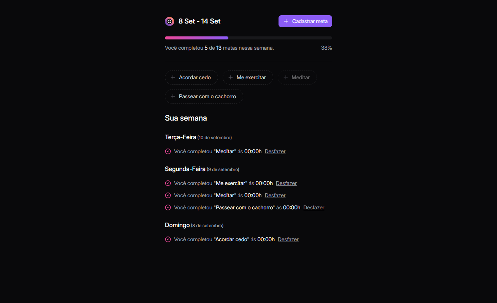

# in.orbit

Created in the event NLW Pocket by Rocketseat, in.orbit is a web application designed to help improve yourself by completing weekly goals.

## Table of Contents
1. [Screenshots](#screenshots)
2. [Functionalities](#functionalities)
4. [Running Locally](#running-locally)
5. [Learnings](#learnings)
6. [About Me](#about-me)

## Screenshots



## Functionalities

- Add goals to the week
- Set how many times you want to achieve each goal per week
- Track your progress with a progress bar

## Running Locally

Clone the project

```bash
  git clone https://link-to-the-project
```

Navigate to the project directory

```bash
  cd my-project
```

# Web Folder

Install dependencies

```bash
  npm install
```

Start the vite server

```bash
  npm run dev
```

# Server Folder

Install dependencies

```bash
  cd server
  npm install
```

Start the server

```bash
  npm run dev
```

Create a container with Docker (Docker must be installed and running)

```bash
  docker compose up -d
```

Run the script seed to add initial goals (optional)

```bash
  npm run seed
```

## Learnings

This was my first time using Drizzle, Tanstack Query, Radix, Docker and Postgres. It was quite challenging, but NLW provided an excellent opportunity to learn. The focus on the database, which was an area I was less familiar with, significantly enhanced my knowledge.

## About me 🙂
I'm 17 years old, studying programming for fun. I aspire to be a full-stack developer.